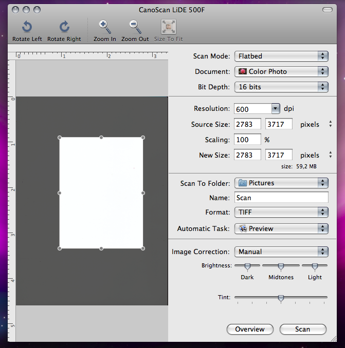
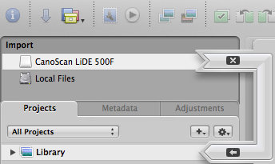
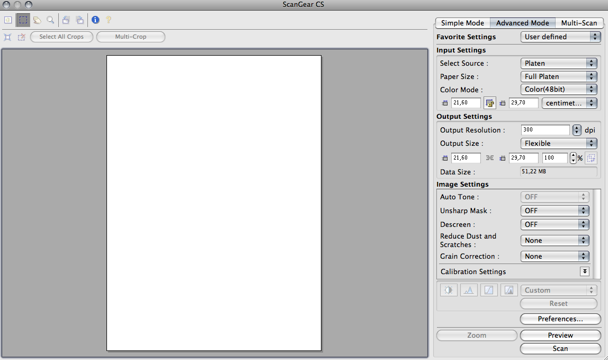
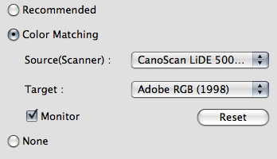

A while ago I [wrote about my problems](http://www.kremalicious.com/2007/06/finally-a-universal-scanner-driver-for-the-canon-canoscan-lide-500f-for-intel-macs/) finding a universal scanner driver from Canon for my CanoScan LiDE 500F to use it under Mac OS X. The solution was the Canon Asia website where a universal driver version was available. But since then Apple released Mac OS X 10.5 Leopard in october 2007 and the Canon driver with the version 11.2.4.0X stopped working on this new operating system.

## Finding and downloading the new driver 11.2.5.0X

But there's a new driver available. It was posted on the Canon USA website on 7 December 2007 and on the Canon Asia website on 28 January 2008. The new version number is 11.2.5.0X for Mac OS X and yes the driver remains a universal scanner driver running fine on both PowerPC- and Intel-Macs.

The changelog says:

> Newly supports Mac OS X v10.5.
> ScanGear Starter is removed. (Because the operation problem occurs when the destination to save the scan file is changed in Mac OS X v10.5.)

So this sounds just right. You can download the new universal scanner driver from [Canon USA](http://www.usa.canon.com/consumer/controller?act=ModelInfoAct&tabact=SupportDetailTabAct&fcategoryid=235&modelid=11011#DownloadDetailAct) or [Canon Asia](http://support-asia.canon-asia.com/contents/ASIA/EN/0900321901.html). Following these links takes you right to the driver download page for this scanner.

You will get a file named lide500fosx11250en.dmg in your downloads folder. Just mount it and double click the package installer inside of the image. If you have a previous version of the driver installed you should remove all parts of it from the system and make a restart to avoid any problems. You can follow my screenshot on the right which shows the contents of the installer package to find all components on your system.

After the installation is finished you have to restart your Mac (very Mac-unlike) because the package installed a new Kernel extention.

After a restart you should be able to use the scanner as a TWAIN device all over the system.

## Using the scanner in Mac OS X Leopard

### Preview / Image Capture

Leopard included a new version of Preview, the pdf and image-viewing application by Apple and also a new version of Image Capture. To use it with your scanner just plug in the scanner, open Preview and choose File > Import Image or just open the Image Capture application. A new scan window should open doing an automatic overview scan. In the scan window you have some minor options like resolution, scaling etc. You can even make simple but powerful image corrections down at the bottom (set it to manual).

But the best thing with the new Image Capture is the feature of setting the bit depth of the scanner to 16 bits. This was just possible before through the Canon software ScanGear in Photoshop.

### Scanning right into Apple Aperture?

 Wouldn't that be great? Although the scanner is shown as a source in the import dialogue you can't import images with it directly from Aperture. Maybe someone will code a generic scanning plugin for Aperture like VueScan for Aperture or something like that. But I guess this is something just Canon is able to do that and they won't.

But using Preview/Image Capture and Automator you can bypass this limitation. If you want to know how you can do that have a look at my article [Scan images directly into Apple Aperture](http://www.kremalicious.com/2008/05/scan-images-directly-into-apple-aperture/).

### Adobe Photoshop CS3

Just like with Creative Suite 2 you can use Photoshop to import images with your Scanner by using the Canon ScanGear software which indeed is just the scan window in Photoshop. Just chose File > Import > CanoScan LiDE 500F in Photoshop. If you have installed the driver for the first time the scan window in Photoshop defaults to Simple Mode. But if you want it simple you better chose a Preview/Image Capture workflow. So in Photoshop you should head over to Advanced Mode and check the preferences button down at the bottom first.

Under the Color Settings tab you should set your preferred color management options.

Under the Scan tab you should enable 48/16 bit Output to enable scanning your images with a depth of 16 bit just like the RAW images from your dslr or digital camera. Click OK to save your preferences.

Another task you should do before scanning the first time with this driver is calibrating your scanner. You can find it in the image settings section where you'll have to click on the double triangle to reveal the options for calibrating. Just click Calibrate and wait until it's finished.

Now you can set your scanning preferences and start scanning into Photoshop. Don't forget to chose Color(48Bit) in the Color Mode dropdown menu for 16 bit scanning.

The advantage of this last workflow with Photoshop and ScanGear is more control over the scanner and therefore more control of the way your images will look right after the scan. If you want simplicity do it the OSX way by using Preview/Image Capture and simply automate it with Automator to serve your scanned images to your preferred application.
