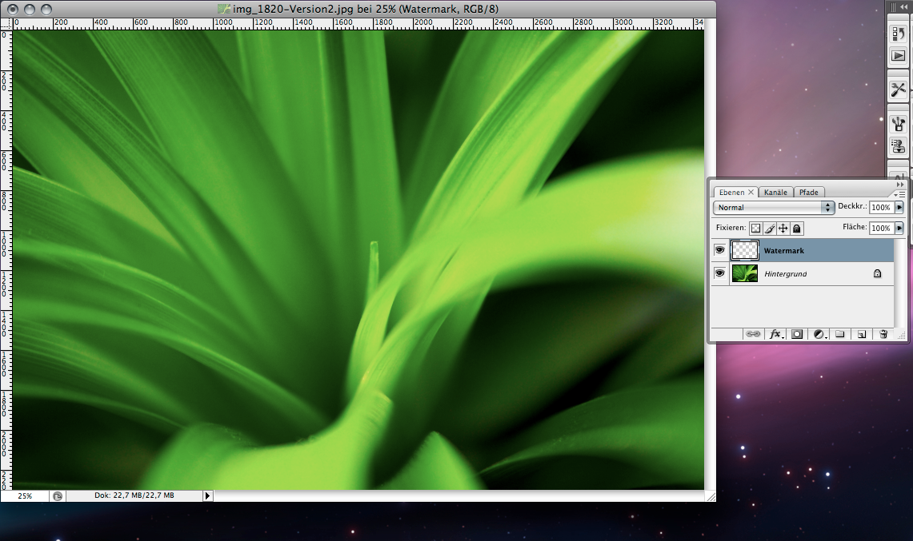
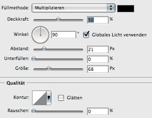
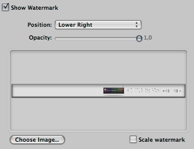
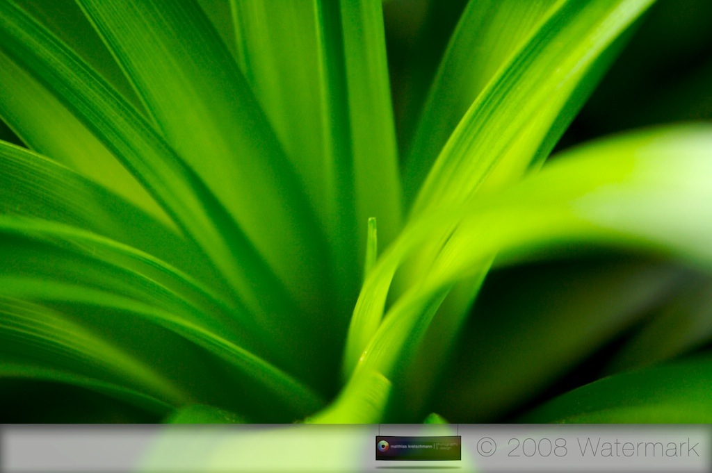
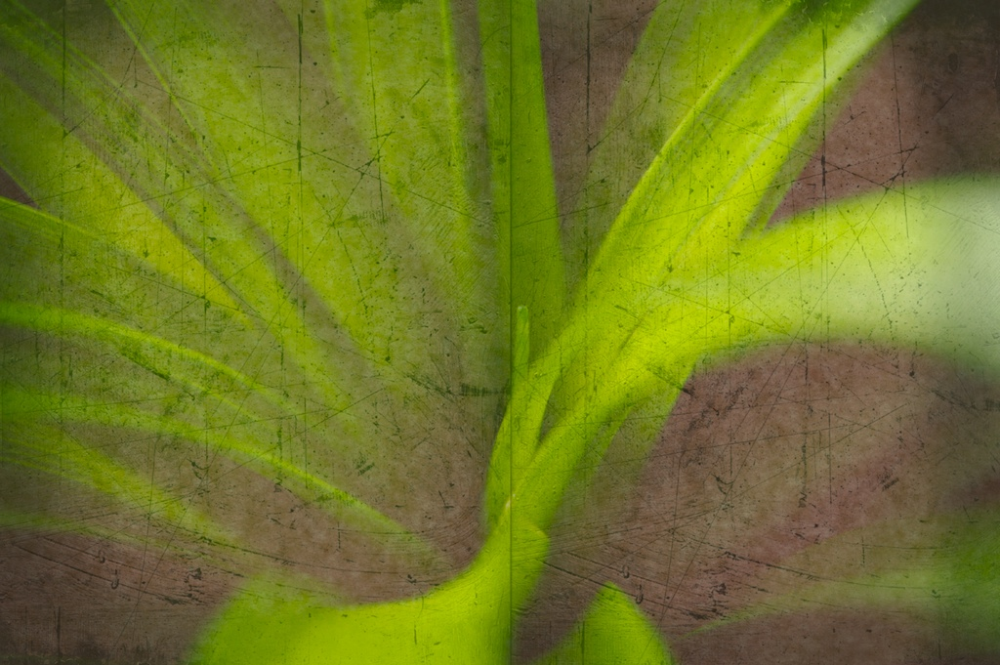

Since version 1.0 Aperture is able to render images on export with a graphic overlay on top of them called watermark. This feature of Apple's Aperture can give you a chance to make stealing your web-published pictures a bit harder. So let's see how we can make Aperture automatically render watermarks on our images during export. In this article we will make a watermark with a transparent background and add some text on top of it.

The steps for this magic involves 4 simple steps:

1. Create a watermark image in Photoshop
2. Render different sizes of the watermark image
3. Define the watermark image inside an export preset in Aperture
4. Make even more...

## 1. Create a watermark image in Photoshop

Open up Photoshop and load a photo taken with your camera in full size (pixel size of course, not file size). If you have photos with different pixel sizes you should use a photo with the biggest pixel size you're going to export from your Aperture library.

To illustrate the process I will use a picture taken by me. Create a new layer on top of the background layer and call it "watermark" or anything you like.

If you want it simple you can start with the Text tool right now but I prefer to add a background so our text is always readable no matter if the photo is dark or light. With the select tool draw a rectangle on the bottom of the image. Then select the Paintbucket tool, chose a foreground color of white and click on the selection in the image so the rectangle selection is filled with white.

Add some inner shadow by double clicking on the watermark layer and adjusting the values for inner shadow (just have a german speaking Photoshop version while writing this article but i guess you can identify the values visually):

Adjust the Fill of the layer to 40%. This will just make the fill color transparent while the opacity of the layer styles are preserved. You should end up with something like this:

Next select the Text tool, chose a black color in the tool preferences and click on the image. A new layer will be automatically created and you can type in the text you want to use in your watermark. For this tutorial I just used the copyright sign (opt + g) with a year and the word "Watermark". I used Helvetica Neue Ultra Light as font face.

Place the text at the bottom right and be sure to add some space to the right and to the bottom. Next set the layer mode of the text layer to "Overlay". Finally I've added a logo and set it's opacity to 80%. So now you should end up with something like this:

Now delete the Background layer. You should see the transparent grid. Next chose Image > Trim from the menu bar, select transparent pixels and click ok. The result should look like this:

Although Aperture is able to render all layers even with their layer styles correctly it has some problems with text layers and their styles. So to be on the save side you should flatten the layers by selecting them all (with command + click on the name of the layers) and pressing command + e which will merge all layers into one. After this step you won't be able to edit your layers so maybe you want to save your document BEFORE this step as an editable psd template file. Be sure that the background of your canvas remains transparent.

Now you're finished with your watermark image. Save it as a .psd file e.g. in your Pictures folder and name it watermark.psd.

Since version 2 Aperture can also handle other filetypes than psd as watermark images. So you can also use a jpg or png file. But remember that jpg can't handle transparency. But you can control the final opacity of the overlay image in Aperture so in the end you can have transparancy with a jpg file. More on that later on.

## 2. Render different sizes of the watermark image

Before starting to create hundreds of watermark images remember that Aperture automatically can scale the watermark image down to fit the size of the exported image. So you could just use one watermark image and have Aperture scale it down to the correct size automatically. But it won't scale it up if your image is bigger, that's why we used a photo with the biggest pixel size you're going to export from Aperture. Just test it out with just one watermark image scaled down by Aperture and decide if the quality is enough for you. But even Apple recommends using different sizes.

If you want to have full control and the highest quality you should repeat the above steps for every pixel size you are going to export from Aperture. So if you have a email preset which resizes the exported image to 600px than you should use a canvas of 600x600px in Photoshop and draw your watermark at that size. You could save those files with the pixel size added in the file name to avoid confusion.

Now you can close Photoshop or let it open if you have enough RAM.

## 3. Define the watermark image inside an export preset

Now we're going to make the watermark image part of an export preset inside Aperture. Open up Aperture and chose Aperture > Presets > Image Export from the menubar. In the Export Presets dialogue add a new preset by clicking on the little plus sign at the bottom left of the dialogue and give it a name:

Now adjust your desired values before the "Show Watermark" part at the right. After you've finished click on the checkbox beside "Show Watermark" to activate watermarks for this export preset. For our example we will set the position of the image to Lower Right. Either drag your freshly created watermark.psd onto the drop field or chose it via Aperture's file inspector by clicking on the Choose Image button. The watermark image is automatically copied over to the Library folder of the user under /Application Support/Aperture/WatermarkImages. Just keep that in mind when you want to update your watermark images.

As said before you can adjust the opacity of your watermark image but since we have included some different transparencies in our file we have to set it to an opacity of 1,0.

Finally you can activate the "Scale watermark" checkbox if you want to use your big sized watermark image once and let Aperture scale it down for you. If you have created different sized watermark images you want to leave this deactivated and create a unique export preset for every size you want to export to. In this example we end up with those values:

If you're done just click OK and select an image you want to export. Select File > Export > Versions from the menubar or press shift + command + e. In the Aperture file dialogue chose your destination and select your freshly created preset from the Export Preset dropdown menu and click OK.

Your image is rendered in the background and you should end up with something like this. Click on it to zoom to the full sized version or open the link to the full image in a new browser window. (the full view image is scaled down with a 1024x1024px preset):

You can also have a look at the psd file by downloading it here:

[PSD-file Aperture Watermark example (zip-file, 557kb)](http://www.kremalicious.com/media/watermark_example_by_kremalicious.zip)

Needless to say that you can be very creative with your watermarks. If you think you have to showcase your watermark image used in Aperture feel free to leave it in the comments for this post.

Here are some quick examples by me:

You can be a bit more subtle:

Or use a subtle colorful spectrum:

## 4. Make even more

You can also use this feature to add borders or a whole new style to your images without the use of a plugin like [BorderFX](http://web.mac.com/reinharduebel/BorderFX/).

Just create a watermark image which has exactly the same size as your exported image in width and height. Draw your desired border around all sides or even add some virtual scratches or other things. Then include it in an export preset in Aperture like we did it before.

And maybe you end up with something like this grunge old look just done with the watermark feature of Aperture:

And that's it. Hope this article helped you mastering the watermark feature of Aperture.

Update: If you're curious about more ways to add watermarks to your images in an Aperture workflow be sure to check out my article [The Definite Guide To Watermarks In Apple Aperture](/the-definite-guide-to-watermarks-in-apple-aperture/) which gives you a brief overview about the various ways you can add watermarks to your images so you can easily choose the best one for your needs.
