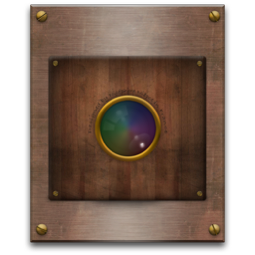
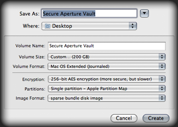
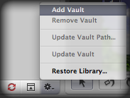
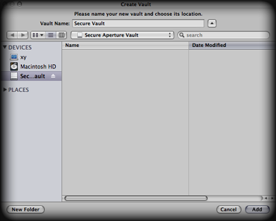
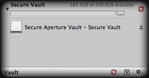

When on the road I always take a little mobile hard drive with me where all my referenced Aperture Masters from the past years and my mobile Aperture Vault (backing up the un-referenced Masters from the current year) reside. But being little and mobile also means the external hard drive can easily be lost or stolen exposing all my pictures to the thief. To avoid that you can use encryption so in the case of a lost or theft the data is not accessible by the thief. This can easily be done with [sparse bundle disk images](http://db.tidbits.com/article/9673) so you won't have to encrypt the whole hard drive with additional software.

So in this quick tutorial I will show you how to create an encrypted Aperture Vault by using Sparse Bundle Disk Images and by utilizing tools built into Mac OS X. All this can be done in two simple steps.

## 1. Create an encrypted disk image

First you have to create the encrypted disk image where the Aperture Vault will reside. So fire up Disk Utility from the Utilities folder inside your Applications folder or use Spotlight to open it.

Be sure there is no device or volume selected in the sidebar and click on the New Image icon in the toolbar. Set a file name of the disk image and the Volume Name (the name of the mounted disk image on your desktop). Change all the settings as seen in the following screenshot. Be sure to select sparse bundle disk image as the Image Format before changing the volume size. This way you can set a bigger volume size than your physical disk space available on your hard drive. After creation the disk image won't be as big as you have set it with volume size. It will grow as you write files to it. For maximum security (but slower performance) select 256-bit AES encryption in the Encryption drop down menu:

Finally set the destination where you want to have the disk image created. To make it all mobile choose your mobile hard drive as destination. After clicking Create you will be asked to provide a password for encrypting the disk image. Be sure to click on the little key icon to use Mac OS X built in password generator. Generate a new extra long password. Type in your new password manually in the Verify field and be sure to check "Remember password in my keychain". This is the only time you have to provide the password since it will be saved in your keychain after clicking OK.

Now your newly created sparse bundle disk image ahould be mounted on your desktop which is perfectly fine for the next step.

## 2. Create the Aperture Vault

Now go to Aperture, choose the Projects tab and click on the little gear wheel at the bottom of the sidebar and choose "Add Vault" from the opened menu.

In the opened dialogue select your mounted disk image under the devices section in your sidebar, give it a name and click Add.

The new Vault will be added to your Vault list and is now to ready to be updated.

Just click the little iSync-style arrow beside your Vault and the Vault be written to your encrypted disk image. When finished you can eject the disk image. It can now be mounted again just with the correct password which is stored in your keychain so won't even recognize the encryption. Of course, when you try to mount this disk image on another mac you have to type in the password or import the entry from your keychain.

## 3. Conclusion

You see it's pretty easy to use secure file encryption just for particular uses on a Mac. The disk image method also provides you with the ability to move the disk image file to another volume and mounting it from the new place without adding or changing the Aperture Vault inside Aperture.

Finally you can have more uses for encrypted disk images. As I've said in the introduction, my referenced Master images reside on my mobile hard drive too. And they are encrypted inside a sparse bundle disk image as well. So you get the idea that you can do a lot more with these encrypted disk images to quickly secure sensible data.
