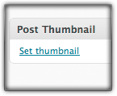
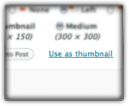

WordPress 2.9 added a new feature which allows you to assign an image to an article to make it the post image like it's often used in magazine style themes. This new feature along with a new template tag makes all the custom field hacks usually used for this functionality in the past obsolete. So here's a quick walkthrough to make use of the new post thumbnail feature and of course how to make it backwards compatible.

## 1. Activate The Feature

For whatever reason you first have to activate the feature with an entry in your theme's _functions.php_ file in order to get the Post Thumbnail box in the Editor.

So just open up your theme's _functions.php_ file in your favorite editor or create it if there's no such file in your theme folder. Add this little code snippet to this file:


<?php
    add_theme_support('post-thumbnails');
?>


For backwards compatibility you should wrap this inside a function check for the new `add_theme_support`:


<?php
    if ( function_exists( 'add_theme_support' ) )
      add_theme_support( 'post-thumbnails' );
?>


This makes sure WordPress installation prior to 2.9 won't get screwed up when using a theme with this new feature.

## 2. Add A Post Thumbnail To Your Post

After you've added the above mentioned code into your _functions.php_ file there should be a new Post Thumbnail box in the WordPress editor view on the right side.

In this box click on the _Set Thumbnail link_ and the usual Add Media dialogue will pop up where you can choose an image from your Media Library. At the end of the dialogue for the selected image there's a new link beside the Insert into Post button called _Use as thumbnail_.

Click this and your chosen image will be assigned as the post thumbnail. (Unfortunately the _Use as thumbnail_ link is missing in the dialogue which appears after uploading an image, it's just there if you browse your Media Library.)

You can close the media dialogue now and you will see the image in the Post Thumbnail box:

## 3. Display The Post Thumbnail In Your Theme

Basically all you have to do is to add this new template tag in your theme files where you want to display the post thumbnail, most certainly in your _index.php_ file:
<?php the_post_thumbnail(); ?>
This template tag will display the thumbnail sized post thumbnail by default and is essentially the same as:

<?php the_post_thumbnail('thumbnail'); ?>

But of course you can grab the other sizes WordPress automatically creates when you upload an image:

<?php
  the_post_thumbnail('medium');
  the_post_thumbnail('large');
?>
_(Note: Matt [left a comment on WP Engineer](http://wpengineer.com/the-ultimative-guide-for-the_post_thumbnail-in-wordpress-2-9/#comment-3053) stating he wouldn't recommend using these named arguments but provided no explanation for it yet.)_

The code will output a generic `` tag with a class of wp-post-image. Needless to say this is what you can select with css to style just the post thumbnails further:
[css].wp-post-image { border: 2px solid #ccc; } [/css]

### Custom Output

If you want to adjust the generated output of the  tag you can do this by using some array stuff. So let's say you want to have the post thumbnails to be 200x200px big and another class assigned to it, you can extend the template tag like so:

<?php the_post_thumbnail(array( 200,200 ), array( 'class' => 'alignleft' )); ?>

If you want to add more than one class you can do this like so:

<?php the_post_thumbnail('medium', array('class' => 'alignleft another_class')); ?>

And you can add any attributes to the `` tag like a `title`, `rel` or an `alt` attribute. For accessibility reasons you should always add at least the alt-attribute:

<?php the_post_thumbnail('medium', array('class' => 'alignleft', 'alt' => 'alttext')); ?>

As for the title attribute this will be grabbed automatically from the entry you've made in your Media Library during the upload process but you even could override this too:


<?php the_post_thumbnail('medium', array('class' => 'alignleft', 'alt' => 'alttext', 'title' => 'titletext')); ?>


### Respect Media Settings

Finally if you want to respect the custom sizes you or your users have set under Settings > Media you can first grab those sizes with [get_option function](http://codex.wordpress.org/Function_Reference/get_option) and then put it in the array:

<?php
  $width = get_option('thumbnail_size_w');  // get the width of the thumbnail setting
  $height = get_option('thumbnail_size_h'); // get the height of the thumbnail setting

  the_post_thumbnail(array($width, $height), array('class' => 'alignleft'));
?>

You can also detect the Media settings for the other sizes and whether the crop setting is active or not:

<?php
  get_option('medium_size_w');  // Width of the medium size
  get_option('medium_size_h');  // Height of the medium size
  get_option('large_size_w');   // Width of the large size
  get_option('large_size_h');   // Height of the large size
  get_option('thumbnail_crop'); // Check for crop, On=1, Off=0
?>

## 4. Make It Bulletproof (a.k.a. Backwards Compatible)

With the check in your functions.php at the beginning there's already ensured old WordPress installations will just skip this feature. But there remains one problem and before you just go ahead and update your theme(s) think about it: the old content in your blog doesn't have a post thumbnail assigned to it through this new feature. You don't want to have you or your theme users update all their older articles, right? And if you already use some sort of post image hack there's probably a special function in your theme which does that.

So it's a pretty good idea to make this backwards compatible with some quick if else voodoo, code shamelessly [adapted from WP-Recipes](http://www.wprecipes.com/wordpress-2-9-display-post-image-with-backward-compatibility):

if ( (function_exists('has_post_thumbnail')) && (has_post_thumbnail()) ) {
  the_post_thumbnail();
} else {
  $postimage = get_post_meta($post->ID, 'post-image', true);
  if ($postimage) {
    echo '';
  }
}

This first checks if the feature exists and if a post thumbnail was addd with this new feature. If it was, it simply returns the post thumbnail. If not, it falls back to whatever you've used in your theme before, the usual way is to check for and get the value of a special custom field named e.g. post-image and output it. You can add whatever you've used before inside the else statement. Et voilà, it's nicely backwards compatible now, yay!

## 5. Resources And More Information

  * WP Engineer: [About WordPress Post Thumbnail](http://wpengineer.com/about-wordpress-post-thumbnail/)

  * WP Engineer: [The Ultimative Guide For the_post_thumbnail In WordPress 2.9](http://wpengineer.com/the-ultimative-guide-for-the_post_thumbnail-in-wordpress-2-9/)

  * WP Recipes: [WordPress 2.9 : Display post image with backward compatibility](http://www.wprecipes.com/wordpress-2-9-display-post-image-with-backward-compatibility)

  * Justin Tadlock: [Everything you need to know about WordPress 2.9’s post image feature](http://justintadlock.com/archives/2009/11/16/everything-you-need-to-know-about-wordpress-2-9s-post-image-feature)

  * Chris Harrison: [Post Thumbnails in RSS Feeds](http://cdharrison.com/2009/12/the_post_thumbnail-for-rss-feeds/)

  * Technosailor: [10 Things You Need to Know About WordPress 2.9](http://technosailor.com/2009/11/11/10-things-you-need-to-know-about-wordpress-2-9/)

Well and that's it. I would love to link to some smart WordPress Codex pages for these new template tags but at the time of this writing there simply isn't anything in the Codex about this.

As always: before making your next coffee you should share this article on your favorite social website. Your vote is highly appreciated! After you've finished voting and making your next coffee or tea you could subscribe to my [RSS-Feed](http://www.kremalicious.com/feed/), discuss this article or buy me my next coffee.

## Article Updates

12/20/2009 Added some resources and a note about the named arguments
12/20/2009 function check for add_theme_support at the beginning
12/20/2009 corrected the size array code under Custom Output
12/17/2009 Added some code examples to respect the media settings
