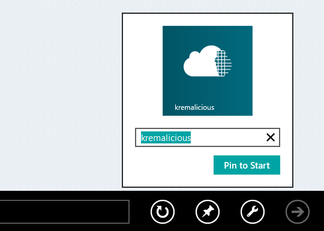
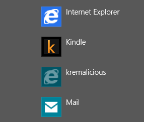

Windows 8 and Internet Explorer 10 make it possible to pin your site to the Metro start screen as a new tile. The tile then is a bookmark to your site and you can control the icon and background color being used.

There was a great [post](https://github.com/h5bp/html5-boilerplate/issues/1136) about that in the H5BP issues section and Microsoft has a [full explanation](https://blogs.msdn.com/b/ie/archive/2012/06/08/high-quality-visuals-for-pinned-sites-in-windows-8.aspx). It all comes down to this:

  * create a 144x144px image with your logo/icon filling the whole canvas and a transparent background
  * add two `meta` tags in the `head` of your site defining the image path and optionally the tile color
  * as noted in the [issue post](https://github.com/h5bp/html5-boilerplate/issues/1136), the image must be saved as a transparent 32bit PNG ("24bit" in Photoshop's Save For Web dialogue) without running it through image optimisers like [ImageOptim](http://imageoptim.com)

While the size is the same as for the iPad 3 homescreen icon, I strongly suggest not using the apple-touch-icon for this. In fact, it might be best not using a full color image at all. Using a white monochrome version of your logo or icon will make your site's tile blend in perfectly with the default Metro UI system tiles.

As an example, I just [pushed](https://github.com/kremalicious/kremalicious2/commit/4c7e215f4abecde4385028767b633be1278f277e) the Metro [tile image](/metro-tile.png) for kremalicious.com with those `meta` tags:

```html
<meta name="msapplication-TileImage" content="/metro-tile.png"/>
<meta name="msapplication-TileColor" content="#015565"/>
```

When browsing the site in Windows 8/Internet Explorer 10, users have the choice of pinning it to the start screen:



And this is how it looks like on the Windows 8 start screen:


As you can see, pinned sites always get a smaller, square tile. Sadly, the image somehow still gets resized which makes it really hard to create pixel perfect icons for it. It's also not possible to horizontally center the image within it's tile, placing the logo at the bottom of the image file ended up the same. That's because the title can fill two rows.

And the image is only used on the start screen but not on the All apps screen where your site will get the default IE logo, at least with the defined background color:



The described behavior and screenshots are from the Windows 8 Consumer Preview and may change. I will update this article if there's new stuff in the final version.
