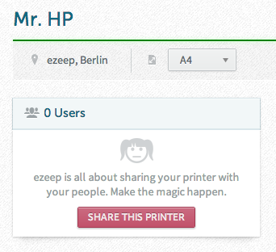

When asking people about printing there’s one common ground – namely, that it sucks. This sentiment comes from the experience with connecting printers with the devices to print, and the act of printing itself with a plethora of print settings to chose from.

	This article originally appeared in the <a href="https://www.ezeep.com/blog/enterprise-software-sucks-but-its-buddha-nature-can-be-unconvered/">ezeep blog</a>.

As Peter Sikking put it wonderfully in his [8 rules of printing interaction](http://blog.mmiworks.net/2008/07/to-istanbul-via-tokyo.html): printing does not exist. Users don’t want to be bothered about the process between thinking of printing and the actual printout. But when they deep dive into the process everyone does something else so “printing turns out to have as many use cases as there are users.”

All current implementations in old and new operating systems are more or less a user-experience nightmare and, combined with the current state of printing hardware and companies adding to the very negative perception of printing in general.

Apart from being ridiculously expensive, creating software targeted towards businesses usually means products with as many features as possible, implemented in the most confusing way imaginable.

## The Buddha Nature

Just throwing the status quo of printing and enterprise software together would create a usability minefield nobody really wants.

At ezeep we’re questioning the assumption that products targeting businesses need to be overly complex and emotionless in order to work. In fact, most so-called enterprise software only works well on the drawing board and in feature-comparison lists, but not for the actual people who use these products. No matter the context, software is always used by human beings and resorting to endless pages of checkboxes with a sprinkle of “corporate blue” is just plain wrong.

Finding the true Buddha nature of our product was crucial for creating an enjoyable and simple-to-use product regardless of other industry standards. This means finding the absolutely necessary essence of our product: What’s the main thing our product is best at? What are the core features needed to make the product work for our customers?

Once found, the buddha nature of a product needs to be defended which involves saying no to many feature requests. A list of features don’t create a product’s experience or main value but rather the holistic view of how and why specific features are implemented.

Just adding feature after feature out of dubious reasons (“Your competitors have it!”) doesn’t add value per se. Even worse, such feature creep destroys the value of the product as a whole. We can add a lot of features but the real question to ask is if we should, based on the very essence of our product. We want to avoid the creation of clutter and noise that would degrade the overall experience.

## ezeep’s Friendly Simplicity

After finding ezeep’s Buddha nature, the next step was to actually create the various elements of our experience and branding, ranging from typography, color, visual style, writing style, interaction models, user flows and more.

While being human and friendly sounds like a no-brainer, in the corporate software world, it turns out it isn’t. ezeep’s vivid color scheme, subtle textures, graphics and icons are a visible manifestation of this, tackling the negative perception of printing for our users.

Creating this layer of delight on top of the functional layers is especially crucial in printing. Good design helps making users more forgiving about errors no matter who’s responsible for them. Printers – the little autistic beings they are – just tend to not work from time to time, and a failing device immediately reflects back on our service. If that’s the case the least we can do is make the experience beautiful.

Paired with helpful and to-the-point copy, this creates a friendly and unifying atmosphere across the whole product, ranging from the web to native apps on Mac, Windows, iOS and Android.

We acknowledge we don’t have all the answers yet or, more precisely, we know what we don’t know. For us the only way to get those answers is by shipping iteration after iteration and learning from them. Feedback rules.
